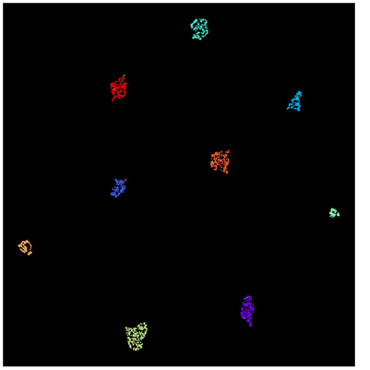
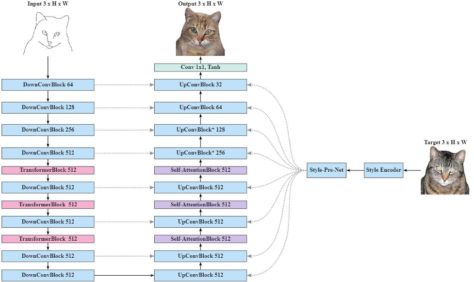
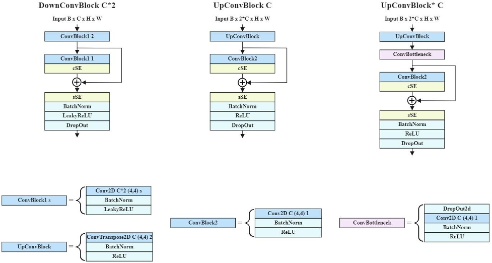
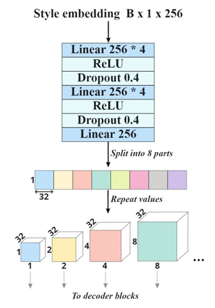
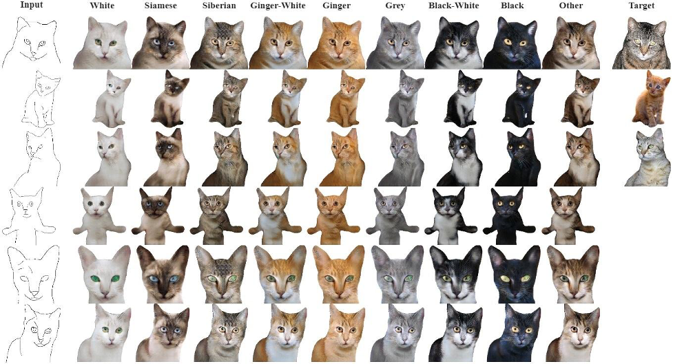

# TransPix2Pix: Hybrid Vision Transformer for Image-to-Image Translation with Style Adaptation

  We propose a novel model for sketch-to-photo translation capable of  producing high fidelity realistic images with style adaptation. Inspired by the performance of the [pix2pix](https://arxiv.org/pdf/1611.07004.pdf) conditional GAN and [Vision Transformer](https://arxiv.org/pdf/2010.11929.pdf), we have developed a hybrid architecture, referred to as TransPix2Pix, that learns spatial and latent dependencies between convolutional features in the image-to-image translation tasks. To perform style adaptation the proposed model makes use of a separately pretrained style encoder, which converts image characteristics into an embedding vector. We apply the developed model for converting sketch images of cats into realistic photos and demonstrate that the proposed approach is more effective than the conventional one in terms of image quality.

### Repository structure:
- **model_generator.py** and **model_discriminator.py** contain TransPix2Pix Generator and Disrimiator models, respectively.
- **transformer_block.py** and **attention_block.py** contain TransformerBlock and Self-AttentionBlock.
- **loss_network.py** includes a network that used for feature reconstruction loss computation.
- **model_ema.py** contains a class, that performs exponential mooving average of models weights.
- The **StyleEncoder** directory includes the Style Encoder model and jupyter notebook with training and inference functions.

### Dataset
  We train models on a custom dataset based on [Kaggle Cat Dataset](https://www.kaggle.com/datasets/crawford/cat-dataset). To prepare sketch-photo pairs we develop a preprocessing pipeline that includes the following steps:
- Cat segmentation using a pretrained [segmentation model](https://github.com/WillBrennan/SemanticSegmentation).
- Sketch generation using a pretrained [photo-to-sketch model](https://github.com/mtli/PhotoSketch).
- Sketch processing using a developed algorithm (to make similar and thin sketches).
- Image cropping and resizing to 256x256  resolution.

The style encoder is trained on a subset of the prepared dataset separated into 9 different cat styles including: black, black-white, gray, siberian, siamese, ginger, ginger-white, white and “other”. The “other” class contains cat styles which do not belong to any other category.

### Style Encoder
  The style encoder represents a convolutional network that encodes cat images into style feature embeddings. The network is based on the [CosFace](https://arxiv.org/pdf/1801.09414.pdf) architecture and composed of a set of convolution blocks followed by the fully connected layers. The convolution part is organized as follows:
- The model consists of 4 convolution blocks.
- Each convolutional layer is followed by BatchNormalization and ReLU.
- We apply residual connections between each couple of adjacent layers with the same dimension.
- The first block consists of 2 convolutional layers with SpatialDropout2D between them.
- Blocks 2, 3 and 4 contain 3 convolutional layers, with the first layer having a stride of 2 to reduce the spatial dimension. SpatialDropout2D is used after the second convolutional layer.
- The number of feature filters has an initial value of 32 and is doubled for each block.
- We apply Dropout to the output of each convolution block.

  The output of the last block is flattened and processed by two linear layers (with BatchNormalization) to form an embedding vector. The obtained embedding is passed through the CosFace layer with the SoftMax function. During training, the network is optimized to minimize the cross-entropy loss function. 

  The proposed style encoder operates in a 256-dimensional latent space.  We have trained several versions of the model and determined that this configuration leads to better performance in terms of classification accuracy and embedding quality. To evaluate the quality of constructed latent space we estimate equal error rates, which are computed using cosine similarity scores by pairing each embedding vector with each class centroid. Figure 1 shows the [U-Map](https://arxiv.org/pdf/1802.03426.pdf) projection of the computed style embeddings.

  
   
    <em>Fig. 1. U-Map projection of the computed style embeddings. Each color corresponds to a different cat style.</em>

### Attention Mechanisms
  To model dependencies between convolutional features TransPix2Pix utilizes the following types of attention mechanisms:
- [Spatial Squeeze & Channel Excitation](https://arxiv.org/pdf/1709.01507.pdf) (cSE) mechanism, which is used to perform channel-wise recalibration of convolutional features.
- [Channel Squeeze & Spatial Excitation](https://arxiv.org/pdf/1803.02579.pdf) (sSE) mechanism, which provides more importance to relevant spatial locations and also ignores irrelevant ones.
- Dot-Product Self-Attention applied for features-wise recalibration. In contrast to sSE this mechanism takes into account the context of each feature vector in the input sequence.
- Multi-head Attention from the [Attention is All You Need paper](https://arxiv.org/pdf/1706.03762.pdf). This type of attention is a key component of all Transformer-based architectures including our proposed model.

### Proposed Model
  The proposed TransPix2Pix system represents a conditional GAN composed of generator and discriminator models. The discriminator is a convolutional “PatchGAN” classifier proposed in the [pix2pix paper](https://arxiv.org/pdf/1611.07004.pdf), while the generator is based on a hybrid [U-Net architecture](https://arxiv.org/pdf/1505.04597.pdf). The block diagram of the generator architecture is illustrated in Figure 2.

  
   
    <em>Fig. 2. The block diagram of the proposed generator architecture.</em>

  The generator combines encoder and decoder modules with the style encoder network. As in the original U-Net generator we apply skip connections between encoder and decoder blocks to reuse encoded features during the decoding process. We employ custom convolutional blocks combined with transformer and self-attention blocks. The diagram in Figure 3 shows structure of developed convolutional blocks, referred to as DownConvBlock, UpConvBlock and UpConvBlock*. As you can see, we used a combination of convolution layers equipped with channel and spatial Squeeze & Excitation mechanisms, residual connections, BatchNormalization, ReLU and LeakyReLU activations and Dropouts. UpConvBlock* contains a ConvBottleneck block serving as an information bottleneck that enhances generalization properties of the decoder module.
  

  
   
    <em>Fig. 3. The block diagram of the proposed convolutional blocks.</em>

  TransformerBlock and Self-AttentionBlock operate on sequences of convolutional features obtained from outputs of convolution blocks as shown in Figure 2. Before passing the processed sequences to the next convolution block they are transformed back into 3-dimensional tensors. TransformerBlock represents a standard transformer encoder composed of 6 layers with Multi-head Attention mechanisms (with 8 heads). Each transformer block utilizes trainable position embeddings to take into account the order of the  input feature sequence. Self-AttentionBlock employs a simple dot-product self-attention mechanism without scaling factor and any projections.
  
  The generator is trained in a transfer learning configuration using embedding vectors produced by the style encoder. Style-Pre-Net serves as a bridge between these two modules  stimulating the extraction of meaningful style characteristics. Moreover, it plays a role of  information bottleneck, which is essential for generalization performance of the decoder module, especially for style adaptation. The block diagram of the Style-Pre-Net network is shown in Figure 4. Before concatenation with the input of each decoder block the output of the Style-Pre-Net network is splitted into 8 parts and transformed into 3-dimensional tensors (repeated along the spatial dimension). This concatenation technique allows us to use style features that are relevant only for a particular decoding stage. We found that all 8 parts of the obtained representation contain unique style characteristics while preserving the properties of the initial embedding space. 
  

  
   
    <em>Fig. 4. The block diagram of the Style-Pre-Net module.</em>

### GAN Loss Function
The TransPix2Pix loss function is based on the sum of discriminator and generator losses proposed in the [pix2pix paper](https://arxiv.org/pdf/1611.07004.pdf). In contrast to the original implementation, we add an additional term to the generator loss. This term represents the feature reconstruction loss described in the [Perceptual Losses for Real-Time Style Transfer and Super-Resolution paper](https://arxiv.org/pdf/1603.08155.pdf). Generally speaking, this technique encourages output and target images to have similar hidden representations computed by the loss network making them perceptually similar to each other. In our implementation we use the VGG16 network pretrained on the ImageNet dataset. We have determined that this configuration leads to improved reconstruction quality.

### Training Setup
The style encoder is trained using the Adam optimizer with a batch size of 64, a weight decay of 10-4 and an initial learning rate of 10-3 exponentially decaying each 1000 steps with a decay rate of 0.9. We use CosFace hyperparameters s and m of  5 and 0.35.

The TransPix2Pix model is trained during 400k steps in a transfer leaning configuration using style embeddings extracted from target images. We apply the Adam optimizer with a batch size of 4, a weight decay of 10-6 and a gradient clipping threshold of 1, maintaining exponential moving averages of the trained parameters with a smoothing value of 0.98. We use an initial learning rate of 0.0002 that is decreased by half every 100k steps.

As suggested in the pix2pix paper, we don't use BatchNormalization in the first encoder block and apply Dropout (with probability of 0.3) only to the first three decoder blocks. Also we use the Dropout2d probability of 0.2 for the first and second ConvBottleneck blocks.

### Inference Examples
During inference, we use average style embeddings to generate images that correspond to a specific cat class. Figure 5 shows 6 generated examples, 3 of which are taken from the validation dataset and the other 3 represent hand-drawn sketches.

  
   
    <em>Fig. 5. Generated examples. Input sketches are shown on the left, while target images (only for validation data) are shown to the right side of the figure.</em>

### Conclusions
We have presented a new hybrid architecture, called TransPix2Pix, which merges the benefits of Transformers and convolutional neural networks for sketch-to-photo translation tasks. Our experiments reveal that integration of transformer encoders and self-attention mechanisms into a U-Net-based architecture leads to improved quality as well as high detalization of reconstructed images. We have used the developed system for translating cat sketches into photorealistic images. 

In addition, we propose a novel approach to style adaptation based on a pretrained style encoder that is used to transfer specific characteristics from target to predicted image. Potentially, the proposed technique can employ a set of different style encoders connected with the generator decoder through the Style-Pre-Net module. In this configuration, each encoder should operate in an embedding space that is responsible for specific characteristics, for example, cat breed, eye color, background and so on. 

Further research will focus on application of TransPix2Pix to other image-to-image translation tasks and experiments with style embeddings.
